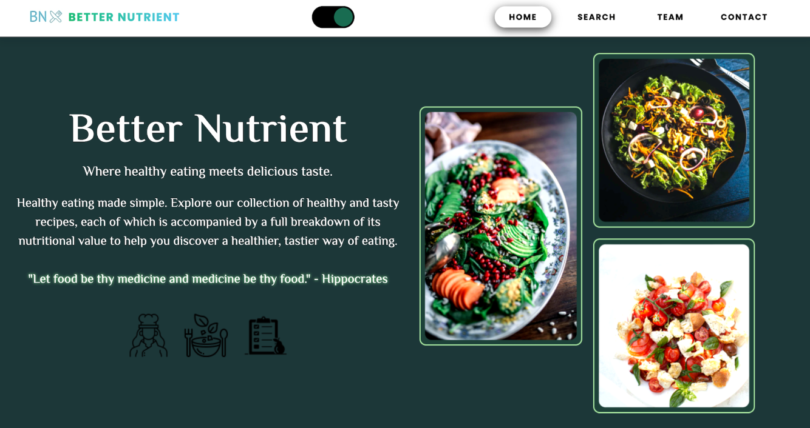

  #  **Better Nutrient** 
  
  ## Table of contents
  - [Project Description](#project-description)
      - [Installation](#installation)
      - [Usage](#usage)
      - [Screenshot](#screenshot)
      - [Built with](#built-with)
      - [What I learned](#what-i-learned)
      - [Continued development](#continued-development)
      - [License](#license)
      - [Authors](#authors)
      - [Credits](#credits)

  # **Project Description**
  Better Nutrient is a website that focuses on promoting healthy living. It 

  ## Installation
  corresponding nutrients and recipe based on their input. This enables users to track their food intake to ensure 

  ## Usage
  NA

  ## Screenshot
  

  
  ## Built with
  
      - [x] Semantic HTML5 markup
      - [x] CSS custom properties
      - [x] JavaScript
      - [x] jQuery
      - [x] Bootstrap
      - [x] Flexbox
      - [x] Mobile-first workflow
      
  
  ## What I learned
  NONE

  ## Continued development
  Just keep learning and building

  ## License
  

  ## Authors
  Jessie

  ## Credits
  none

 

  