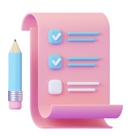

  #  **Better Nutrient** 
  
  ## Table of contents
  - [Project Description](#project-description)
      - [Installation](#installation)
      - [Usage](#usage)
      - [Screenshot](#screenshot)
      - [Built with](#built-with)
      - [What I learned](#what-i-learned)
      - [Continued development](#continued-development)
      - [License](#license)
      - [Authors](#authors)
      - [Credits](#credits)

  # **Project Description**
  Better Nutrient is a website that focuses on promoting healthy living.

  ## Installation
  ```
# Clone this repository:
git clone https://github.com/KingJessie/Better_Nutrient.git
cd Better_Nutrient
# To open folder in VS Code
code .
```


  ## Usage
  No usage provided

  ## Screenshot
  

  
  ## Built with
  * - [x] Semantic HTML5 markup 
 - [x] CSS custom properties 
 - [x] JavaScript 
 - [x] jQuery 
 - [x] Bootstrap 
 - [x] Flexbox 
 - [x] Mobile-first workflow

  
  ## What I learned
  Through this process, we have 

  ## Continued development
  challenged ourselves to continue our learning on integrating two different API's and retrieving information from 

  ## License
  [](https://opensource.org/licenses/ISC)

  ## Authors
  * Jessie
* Sophie
* Ebele

  ## Credits
  no
  


  