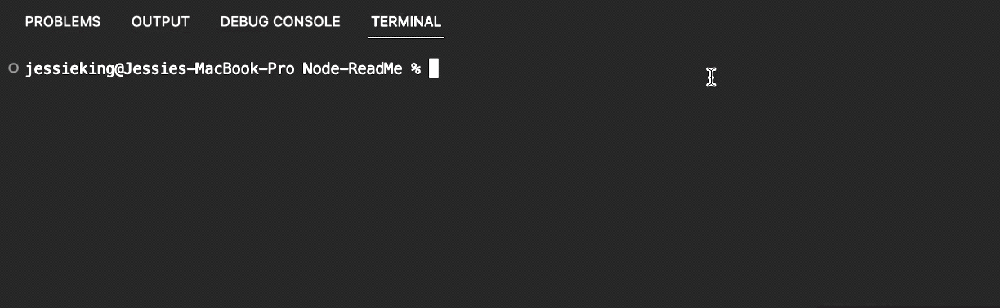

# ReadMe Generator


## Table of contents
  - [Description](#description)
  - [User Story](#user-story)
      - [Installation](#installation)
      - [Usage](#usage)
      - [Demo](#demo)
      - [Resources](#resources)
      - [License](#license)
      - [Author](#author)
      

# Description:
When launching an open source project on GitHub, it is essential to have a decent README for the application. This should cover the app's purpose, how to use the app, how to install the app, how to report issues, and how to contribute; this last section increases the likelihood that other developers will contribute to the project's success. 

<br>

## ***User Story***

<sub>As a developer, I want a README generator so that I can quickly create a professional README for a new project.</sub>

<br>

## **Installation:**
The purpose of Inquirer.js is to provide a command-line interface for Node.js that is high quality and simple to integrate.

<br>

**Requirements:**
* [Javascript](https://www.javascript.com/)
* [Node.js](http://nodejs.org)
* [Inquirer.js](https://github.com/inquirer/inquirer.js)

- [x] Run Node.js applications from the command line.
- [x] Import and use the native fs module to read and write to the file system.
- [x] Install third-party modules like inquirer using npm.

```
# npm install inquirer:
npm init -y
npm install inquirer@^8.0.0
```

<br>

The application will be invoked by using the following command:

```bash
node index.mjs
```

## Usage:
With this application, you can generate a README file quickly and effortlessly through a command-line interface. This allows the project creator to devote more time to working on the project.

<br>
 
## Demo


<br>

## Resources:
- **Inquirer package** - https://www.npmjs.com/package/inquirer
- **SBoudrias** - https://github.com/SBoudrias/Inquirer.js/blob/master/README.md

<br>

## License
[](https://opensource.org/licenses/MIT)

MIT License

Copyright (c) 2023 KingJessie

Permission is hereby granted, free of charge, to any person obtaining a copy of this software and associated documentation files (the "Software"), to deal in the Software without restriction, including without limitation the rights to use, copy, modify, merge, publish, distribute, sublicense, and/or sell copies of the Software, and to permit persons to whom the Software is furnished to do so, subject to the following conditions:

<sub>The above copyright notice and this permission notice shall be included in all copies or substantial portions of the Software.</sub>

<sub>THE SOFTWARE IS PROVIDED "AS IS", WITHOUT WARRANTY OF ANY KIND, EXPRESS OR IMPLIED, INCLUDING BUT NOT LIMITED TO THE WARRANTIES OF MERCHANTABILITY, FITNESS FOR A PARTICULAR PURPOSE AND NONINFRINGEMENT. IN NO EVENT SHALL THE AUTHORS OR COPYRIGHT HOLDERS BE LIABLE FOR ANY CLAIM, DAMAGES OR OTHER LIABILITY, WHETHER IN AN ACTION OF CONTRACT, TORT OR OTHERWISE, ARISING FROM, OUT OF OR IN CONNECTION WITH THE SOFTWARE OR THE USE OR OTHER DEALINGS IN THE SOFTWARE.</sub>

<br>

## Author:
Jessie Kinganga: 
[Github](https://github.com/KingJessie)

